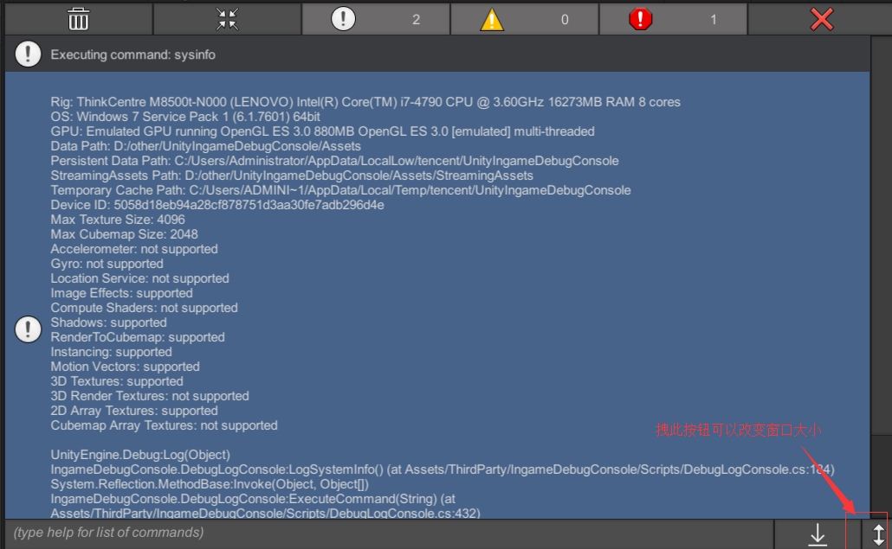

# Unity 3D 游戏内部控制台

### 控制台界面


原github地址:https://github.com/yasirkula/UnityIngameDebugConsole.git
### 运行指令

你可以输入指令"*help*"来获取所有的注册的指令，同时装载了xlua的功能，你可以以"*lua:*"后面跟上**xlua**的脚本可以操作C#这边几乎所有的函数

你也可以通过 **ConsoleMethodAttribute**这个Attribute来注册一些指令，建议使用静态函数进行标记。

函数支持一些参数：

**Primitive types, string, Vector2, Vector3, Vector4, GameObject**

例子代码：
```csharp
using UnityEngine;
using IngameDebugConsole;

public class TestScript : MonoBehaviour
{
	[ConsoleMethod( "cube", "Creates a cube at specified position" )]
	public static void CreateCubeAt( Vector3 position )
	{
		GameObject.CreatePrimitive( PrimitiveType.Cube ).transform.position = position;
	}
}
```

然后在控制台输入`cube [0 2.5 0]`即可在position (0,2.5,0)的位置上创建一个Cube.


控制台指令参数输入注意事项:

- float类型的数字不要以f结尾
- string类型的参数要用("")装载起来
- vector2~4的变量使用 ( [] ) 或者 ( () )装载

参数的一些默认选项:

- 你可以使用 [] 来代表Vector.zero
- 你可以使用1代表true,0代表false
- 

游戏内部要注销指令可以使用代码
```csharp
DebugLogConsole.RemoveCommand( string command )
```

**xlua**的使用详见：https://github.com/Tencent/xLua

lua控制台例子：
```lua
lua:
CS.UnityEngine.Debug.Log("13224")
```

lua代码使用注意事项：

每一次运行lua都会新建一个虚拟机，执行完毕后就销毁，所以不要注册啥全局函数
```csharp
var env = new XLua.LuaEnv();
env.DoString(command.Substring(4));
env.Dispose();
```
如果要使用虚拟机调用游戏内部的lua函数请使用函数将规则加到控制台中：
```csharp
DebugLogConsole.AddCommondRuleAction(your rule)
```

### 操作指引
    打开example中的consle.unity场景
    使用回车键可以扩大输入框
    Ctrl+回车键 或者点击发送按钮执行指令
    手机上从电脑上发送信息上来，然后粘贴进去吧

#### 运行lua代码


#### 运行指令代码
